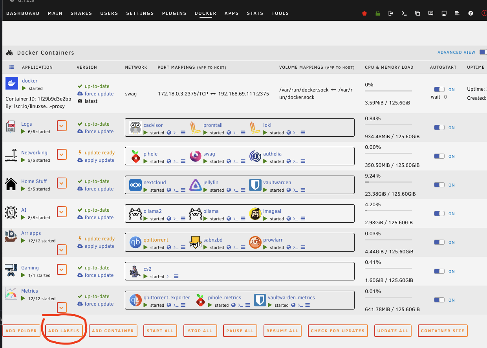
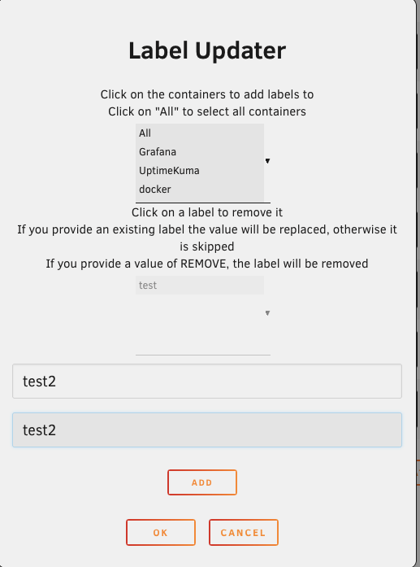

# docker.labelInjector

After installing, just click the "Add Labels" button

Then simply choose the containers you want to add the label value combos to, to choose All for all.

If the label exists already an update will be performed.

If the label does not exist it will be added.

If you enter a value of `REMOVE` it will instead remove the label if found.

Before it updates it will backup the template being used just incase something does go wrong.

If you find this happen you should eb able to restore the backup via `/boot/config/plugins/dockerMan/templates-user/my-TEMPLATE_NAME.DATE.bak`
